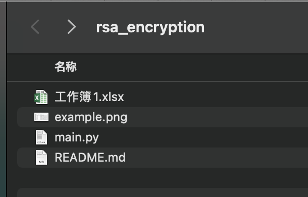
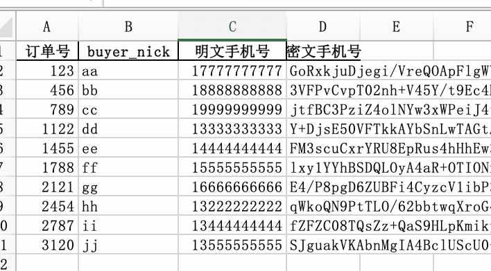

# rsa_encryption


## 脚本用处

会使用填在 lianwei_key_pub 里的RSA公钥去加密

与它在同一路径下、已保存关闭、扩展名为.xlsx的excel文件里的 第一个sheet、叫为「明文手机号」的列


## 怎么用

1. 安装依赖

```python
pip install pandas
pip install pycrypto
```

2. 把用来加密的公钥填到 `lianwei_key_pub`，下面是示例，不要直接用

```python
lianwei_key_pub = '''
MIIBIjANBgkqhkiG9w0BAQEFAAOCAQ8AMIIBCgKCAQEA5w/xioNB+WRleATGaxkY
xRwegK/IQT3L8VjDyyXl//ILi6UUixBjuMbDzM6J3n000j7OA7tcvYiFu/FkT5O+
ee6/NGQIw5Ty2wy5nDa3D2A1l6WrloH1Ra04ODuUJ2hh0HPp8TgxcNo/z+OI1LuO
I+NU37JxS8Y5FaSV6vDes+k5a9sfC0vosS9PHR/jM3AtzA3piBM+9mscnNpRlert
MlZOUzBKnaaTLUlWtDlhe2U+8nK2HJ+DelXrnynMX6KPxU+hyyhNmMZbYjOVp419
l8cSy/y/ibbd/WG3t2dtpCZqLgKawVK57V7f/uvnvHZzWFtbXyZdu4adQnu9f/RR
IQIDAQAB
'''
```

3. 把脚本和有「明文手机号」，待加密的xlsx文件放在一个文件夹下



4. 运行`main.py`

```
cd /Users/zhu/Desktop/rsa_encryption
python main.py
```

5. 输出

```
使用公钥:

-----BEGIN PUBLIC KEY-----
MIIBIjANBgkqhkiG9w0BAQEFAAOCAQ8AMIIBCgKCAQEA5w/xioNB+WRleATGaxkY
xRwegK/IQT3L8VjDyyXl//ILi6UUixBjuMbDzM6J3n000j7OA7tcvYiFu/FkT5O+
ee6/NGQIw5Ty2wy5nDa3D2A1l6WrloH1Ra04ODuUJ2hh0HPp8TgxcNo/z+OI1LuO
I+NU37JxS8Y5FaSV6vDes+k5a9sfC0vosS9PHR/jM3AtzA3piBM+9mscnNpRlert
MlZOUzBKnaaTLUlWtDlhe2U+8nK2HJ+DelXrnynMX6KPxU+hyyhNmMZbYjOVp419
l8cSy/y/ibbd/WG3t2dtpCZqLgKawVK57V7f/uvnvHZzWFtbXyZdu4adQnu9f/RR
IQIDAQAB
-----END PUBLIC KEY-----


读取 /Users/zhu/Desktop/rsa_encryption 文件夹下所有xlsx文件...
读取 工作簿1.xlsx ...
文件 工作簿1.xlsx ，找到明文手机号，总行数: 10，为空行数: 0.
带密文xlsx文件覆盖至: /Users/zhu/Desktop/rsa_encryption/工作簿1.xlsx ...
```


## 输出文件样例

会在有「明文手机号」的excel文件里新增一列「密文手机号」，内容是 明文手机号」被`lianwei_key_pub`公钥加密后的密文️





## 要注意的

1. 公钥可以带头

```
lianwei_key_pub = '''
-----BEGIN PUBLIC KEY-----
MIIBIjANBgkqhkiG9w0BAQEFAAOCAQ8AMIIBCgKCAQEA5w/xioNB+WRleATGaxkY
xRwegK/IQT3L8VjDyyXl//ILi6UUixBjuMbDzM6J3n000j7OA7tcvYiFu/FkT5O+
ee6/NGQIw5Ty2wy5nDa3D2A1l6WrloH1Ra04ODuUJ2hh0HPp8TgxcNo/z+OI1LuO
I+NU37JxS8Y5FaSV6vDes+k5a9sfC0vosS9PHR/jM3AtzA3piBM+9mscnNpRlert
MlZOUzBKnaaTLUlWtDlhe2U+8nK2HJ+DelXrnynMX6KPxU+hyyhNmMZbYjOVp419
l8cSy/y/ibbd/WG3t2dtpCZqLgKawVK57V7f/uvnvHZzWFtbXyZdu4adQnu9f/RR
IQIDAQAB
-----END PUBLIC KEY-----
'''
```

也可以不带

```
lianwei_key_pub = '''
MIIBIjANBgkqhkiG9w0BAQEFAAOCAQ8AMIIBCgKCAQEA5w/xioNB+WRleATGaxkY
xRwegK/IQT3L8VjDyyXl//ILi6UUixBjuMbDzM6J3n000j7OA7tcvYiFu/FkT5O+
ee6/NGQIw5Ty2wy5nDa3D2A1l6WrloH1Ra04ODuUJ2hh0HPp8TgxcNo/z+OI1LuO
I+NU37JxS8Y5FaSV6vDes+k5a9sfC0vosS9PHR/jM3AtzA3piBM+9mscnNpRlert
MlZOUzBKnaaTLUlWtDlhe2U+8nK2HJ+DelXrnynMX6KPxU+hyyhNmMZbYjOVp419
l8cSy/y/ibbd/WG3t2dtpCZqLgKawVK57V7f/uvnvHZzWFtbXyZdu4adQnu9f/RR
IQIDAQAB
'''
```

2. 加密的每行手机号应该不超过117字节